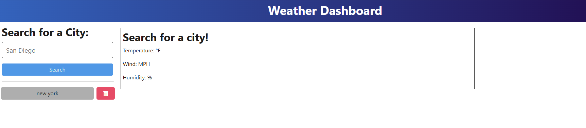
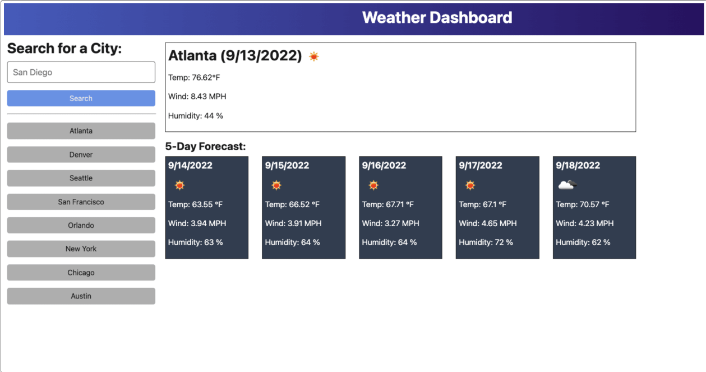

# WeatherDashboard

# ReadMe Generator

No license.

## Description

A readme generator to save time in formating and creating a new file.

## Table of Contents

- [Installation](#installation)
- [Usage](#usage)
- [Demo](#Demo)
- [License](#license)
- [Contributing](#contributing)
- [Tests](#tests)
- [Questions](#questions)

## Installation

Launch the app from link.

## Usage

This allows the user to see the weather forecast for a given city.

## Demo

<h3>Intended interface:</h3>

<h3>Current:</h3>

## License

N/A.

## Contributing

Make sure to cite my github

## Tests

undefined

## Questions

For any questions, please contact me at [N/A](mailto:N/A).

Check out my GitHub profile: [Michel-Gomes33](https://github.com/Michel-Gomes33)
    